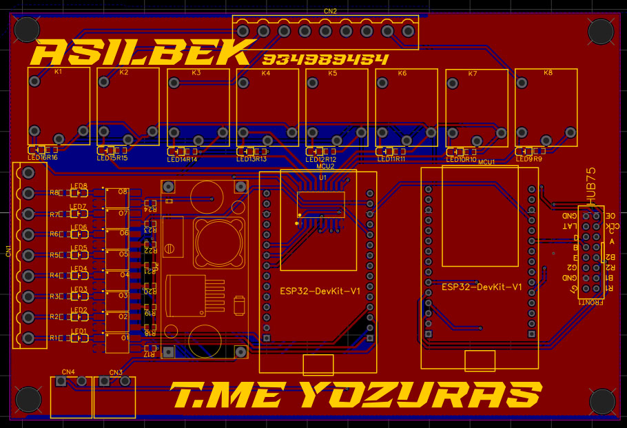

# 🇺🇿 UniPay Industrial Controller

> **The first Open Source, Dual-Core Industrial Controller designed for Uzbekistan's self-service automation market.**

---

## 📸 3D Visualization

*(Note: To view the full 3D model, please download the OBJ file below)*

---

## 🧠 The "Dual Brain" Architecture

Unlike standard controllers, **UniPay** uses TWO microcontrollers to ensure zero latency and high stability.

| **MCU 1: The Muscle 💪** | **MCU 2: The Face 🤖** |
| :--- | :--- |
| **Logic & Power Control** | **Display & Payment** |
| Handles 8x High-Power Relays | Drives HUB75 LED Matrix (P10) |
| Manages Wi-Fi & Server Sync | Reads Coin/Bill Acceptor Pulses |
| Reads Isolated Sensors | Communicates via UART |

---

## 📂 Downloads (Source Files)

We believe in Open Hardware. Here are the files to build it yourself:

| File Type | Description | Link |
| :--- | :--- | :--- |
| **📄 Schematic** | Full circuit diagram (PDF) | [Download PDF](schematic.pdf) |
| **🏭 Manufacturing** | Gerber files for PCB Factory | [Download Gerber (.zip)](gerber_file.zip) |
| **🧊 3D Model** | OBJ & MTL files for Blender/CAD | [Download 3D Model (.zip)](3d_model.zip) |

---

## ⚡ Technical Superpowers

* **Industrial Grade:** All inputs are protected via **Optocouplers** (Galvanic Isolation).
* **High Load:** 8x Relays driven by **ULN2803** Darlington Array.
* **Cost Efficient:** Replaces expensive ($200+) proprietary boards with a <$50 solution.
* **Voltage:** 12V DC Input (Standard for Car Washes).

## 🎯 Why this project?

In Uzbekistan, self-service businesses are booming, but controllers are expensive and closed. **UniPay** aims to empower local engineers to build their own automation systems using affordable ESP32 technology.

---
### 🛠 Request for Hack Club
**We have finished the design. We need the OnBoard grant to manufacture the PCB and bring this project to life!**

*Made with ❤️ by Asilbek.*
